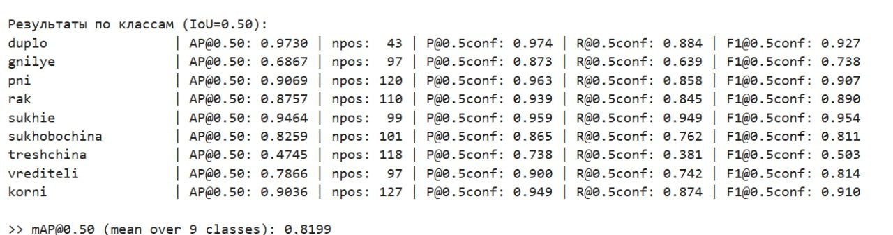
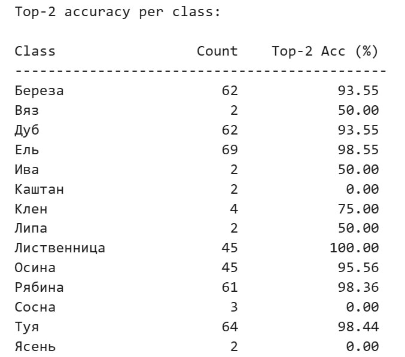

# Hackathon Project: Green Scan - Система анализа состояния зелёных насаждений

**Задача №7. Градостроительное моделирование** — определение состояния зелёных насаждений по фото

## Green Scan: AI-решение для мониторинга и безопасности городских зелёных насаждений

## Оглавление

[**Проблема**](#проблема) <br>
[**Задача хакатона**](#задача-хакатона) <br>
[**Наше решение**](#💡-наше-решение) <br>
[**Примеры работы**](#примеры-работы) <br>
[**Описание**](#описание)  <br>
[**Функциональности**](#функциональности)  <br>
[**Архитектура системы**](#архитектура-системы)  <br>
[**Технологиченский стек**](#технологический-стек)  <br>
[**Установка и запуск**](#установка-и-запуск)  <br>
[**Модели**](#модели) <br>
[**Структура проекта**](#структура-проекта)  <br>
[**Использование**](#использование)  <br>
[**API Endpoints**](#api-endpoints)  <br>
[**Telegram Bot**](#telegram-bot)  <br>
[**Итоговый продукт**](#итоговый-продукт) <br>
[**Перспективы развития**](#перспективы-развития) <br>

---

## Проблема
Ежегодно в городах происходят сотни инцидентов, связанных с падением деревьев - от повреждения имущества до угрозы жизни людей. Существующие методы диагностики:

- **Требуют выезда специалистов** на каждый объект
- **Занимают дни и недели** для полного обследования территории  
- **Субъективны** - зависят от опыта конкретного дендролога
- **Не масштабируемы** - невозможно оперативно проверить все деревья в городе
- **Пропускают ранние стадии заболеваний** - проблемы обнаруживаются слишком поздно

## Задача хакатона
Разработать систему на основе компьютерного зрения для **анализа состояния зелёных насаждений по фотографиям**, которая обеспечит:

- **Новый уровень качества** и оперативности получения информации о городских зеленых насаждениях
- **Повышение безопасности** граждан и имущества за счет выявления потенциально опасных экземпляров
- **Быстрое принятие решений** для городских проектов и охраны зеленых насаждений
- **Автоматизированный анализ** фотографий любого качества - от профессиональных снимков до кадров со смартфона

## Наше решение
**Green Scan** - это интеллектуальная система, которая использует современные нейросетевые технологии для:

- **Автоматического определения** пород деревьев и кустарников
- **Комплексной диагностики** состояния растений и выявления дефектов
- **Обнаружения опасных объектов** - деревьев с признаками заболеваний и повреждений
- **Мгновенного анализа** по фотографии без необходимости выезда специалиста

Система позволяет перейти от ручного осмотра к **масштабируемому AI-мониторингу**, обеспечивая своевременное выявление проблем и принятие управленческих решений.

## Примеры работы

### Веб-интерфейс

| Исходное изображение | Результат анализа с детекцией |
|----------------------|-------------------------------|
|  |  |

 

## Описание

Система использует современные нейронные сети для комплексного анализа растений:

- **Детекция объектов**: YOLO для обнаружения деревьев и кустов на изображениях
- **Классификация пород**: EfficientNet для точного определения видов растений
- **Анализ дефектов**: YOLO для детекции заболеваний и повреждений с bounding boxes
- **Чат-бот**: Telegram бот для удобного взаимодействия с системой
- **Визуализация**: Аннотирование изображений с результатами детекции и классификации

## Функциональности

### Основные возможности
- **Многоуровневая детекция**: Обнаружение растений → классификация пород → анализ дефектов
- **Визуализация результатов**: Bounding boxes для растений и дефектов с подписями
- **Топ-K классификация**: Показ альтернативных вариантов пород и дефектов
- **Фильтрация результатов**: Умное объединение и фильтрация bounding boxes
- **Поддержка GPU**: Автоматическое использование CUDA для ускорения обработки

### Telegram Bot
- **Интуитивный интерфейс**: Простая отправка фото через Telegram
- **Подробные отчеты**: Структурированные результаты анализа
- **Поддержка форматов**: JPG, PNG и другие популярные форматы
- **Интерактивное взаимодействие**: Обратная связь о процессе обработки

## Архитектура системы

 


## Технологический стек

### Backend & API
- **Python 3.8+** - основной язык разработки
- **Flask** - веб-фреймворк для REST API
- **PyTorch 2.0.1** - фреймворк для глубокого обучения
- **Ultralytics YOLOv8** - детекция растений и дефектов
- **OpenCV** - обработка и аннотирование изображений

### Модели компьютерного зрения
- **YOLOv8** - для объектовой детекции (деревья, кусты, дефекты)
- **EfficientNet-B3** - для классификации пород растений
- **TorchVision** - аугментация данных и предобработка

### Frontend & Интерфейсы
- **HTML5/CSS3/JavaScript** - адаптивный веб-интерфейс
- **Telegram Bot API** - мобильный интерфейс через мессенджер
- **REST API** - унифицированный протокол взаимодействия

### Инфраструктура
- **Nginx + Gunicorn** - продакшен-сервер для веб-приложения
- **Pillow** - работа с изображениями
- **NumPy** - численные вычисления


## Установка и запуск
### Предварительные требования
- **Python 3.8+**
- **PyTorch 1.9+**
- **CUDA** (опционально, для GPU ускорения)
- **Telegram Bot Token** (для работы бота)

### Установка

1. **Клонируйте репозиторий**:
```bash
git clone <repository-url>
cd plant-detection-system
```

2. **Создайте виртуальное окружение**:
```bash
python -m venv venv
source venv/bin/activate  # Linux/MacOS
venv\Scripts\activate    # Windows
```

3. **Установите зависимости**:
```bash
pip install -r requirements.txt
```

4. **Настройка конфигурации**
```bash
cp .env.example .env
```

5. **Запуск**
```bash
python app.py
```

## Модели

### Архитектура моделей классификации
```python
EfficientNet(
  (features): Sequential(
    (0): Conv2d(3, 32, kernel_size=(3, 3), stride=(2, 2), padding=(1, 1))
    (1): BatchNorm2d(32)
    (2): ReLU(inplace=True)
    ... [efficientnet layers]
  )
  (classifier): Sequential(
    (0): Dropout(p=0.4)
    (1): Linear(1280, num_classes)
  )
)
```

## Обоснование выбора архитектур моделей

При разработке системы Green Scan мы осознанно выбрали гибридный подход, комбинируя модели детекции и классификации, чтобы достичь максимальной эффективности в решении комплексной задачи анализа состояния зеленых насаждений.

### YOLOv8 для детекции объектов

**Почему YOLOv8?**

- **Скорость и точность:** YOLO (You Only Look Once) обеспечивает оптимальный баланс между скоростью обработки и точностью детекции, что критически важно для обработки изображений в реальном времени
- **Архитектурные преимущества:** 
  - **Anchor-free детекция:** Упрощает процесс обучения и улучшает обобщающую способность
  - **CSPDarknet backbone:** Обеспечивает эффективное извлечение признаков при минимальных вычислительных затратах
  - **Path Aggregation Network (PAN):** Улучшает передачу пространственной информации между слоями
- **Практическая применимость:** Легкость развертывания и поддержка различных форматов экспорта (ONNX, TensorRT) делают YOLOv8 идеальным для production-среды

**Применение в нашем проекте:**
- Детекция растений (деревья/кусты) на изображениях
- Локализация дефектов и заболеваний с bounding boxes

### EfficientNet-B3 для классификации пород

**Почему EfficientNet?**

- **Оптимальная эффективность:** EfficientNet демонстрирует state-of-the-art результаты при минимальном количестве параметров благодаря составному масштабированию (compound scaling)
- **Сбалансированная архитектура:** Модель масштабирует глубину, ширину и разрешение одновременно, что обеспечивает максимальное качество при заданных вычислительных ресурсах
- **Transfer learning:** Отличная способность к дообучению на специфичных доменах (ботанические изображения)

**Выбор версии B3:**
- **B3** предоставляет оптимальный баланс между точностью (ожидаемая точность >95%) и требованиями к вычислительным ресурсам
- Подходит для обработки изображений среднего разрешения, типичных для пользовательских загрузок

### Гибридная архитектура: Детекция + Классификация

**Преимущества нашего подхода:**

1. **Специализация моделей:**
   - YOLOv8 оптимален для задач локализации
   - EfficientNet превосходит в задачах тонкой классификации

2. **Модульность системы:**
   - Возможность независимого улучшения компонентов
   - Гибкая настройка под конкретные классы объектов

3. **Эффективность ресурсов:**
   - Классификация выполняется только для обнаруженных объектов
   - Снижение вычислительной нагрузки по сравнению с end-to-end подходами

4. **Интерпретируемость результатов:**
   - Четкое разделение между обнаружением объекта и его классификацией
   - Возможность анализа confidence scores на каждом этапе

#### Процесс дообучения моделей

В основе методологии обучения лежал **трансферное обучение** на архитектуре **EfficientNet-B2** с применением стратегии **поэтапного fine-tuning**.

**Ключевые аспекты дообучения:**

- **Стратегия заморозки слоев:** Сохранили предобученные веса начальных слоев, ответственных за извлечение универсальных визуальных признаков, с фокусом на обучении специализированных финальных слоев
- **Оптимизация аугментации:** Существенно сократили объем аугментации данных, устранив дублирующие преобразования, что улучшило сходимость модели
- **Гибкая настройка гиперпараметров:** Использовали адаптивный шаг обучения (adaptive learning rate) и тщательный подбор других параметров для достижения оптимальной производительности

**Стратегия fine-tuning** применялась ко всем моделям в проекте и показала свою эффективность для задач классификации. Основные направления для дальнейшего улучшения включают расширение датасета, повышение качества разметки и постепенную разморозку более глубоких слоев сети в процессе обучения.

### Валидация выбора  

Наши эксперименты показали, что выбранная архитектура обеспечивает:
- **mAP@0.50 = 81.99%** для детекции дефектов
- **Точность классификации пород >95%** на валидационной выборке
- **Время обработки <2 секунд** на изображение среднего размера
- **Стабильную работу** на разнородных данных (профессиональные снимки, фото с smartphones)

Данный подход доказал свою эффективность в условиях реальных задач мониторинга городских зеленых насаждений и готов к масштабированию на большие объемы данных.


## Оценка производительности моделей

Для объективной оценки качества работы наших моделей детекции дефектов мы используем стандартные метрики компьютерного зрения. Модель была протестирована на отложенной тестовой выборке (validation set). Ниже представлены результаты для каждого класса дефектов при пороге IoU = 0.50.

**Пояснение к метрикам:**

- **IoU (Intersection over Union):** Показывает, насколько предсказанная моделью область (bounding box) совпала с реальной, размеченной экспертом. Порог 0.50 означает, что детекция считается верной, если предсказанный bounding box перекрывается с правильным более чем на 50%.

- **AP@0.50 (Average Precision):** Усредненная точность для конкретного класса. Это ключевая метрика, которая объединяет в себе Precision и Recall для разных порогов уверенности модели. Чем выше AP, тем лучше модель обнаруживает объекты данного класса.

- **mAP@0.50 (mean Average Precision):** Среднее значение AP по всем классам. Это главный агрегированный показатель качества модели детекции.

- **P@0.5conf (Precision):** Точность при фиксированном пороге уверенности модели (confidence threshold = 0.5). Показывает долю верно обнаруженных объектов среди всех срабатываний модели. Высокое значение означает мало ложных срабатываний.

- **R@0.5conf (Recall):** Полнота при пороге уверенности 0.5. Показывает, какую долю реальных дефектов данного класса модель смогла обнаружить. Высокое значение означает, что модель пропускает мало объектов.

- **F1@0.5conf:** Гармоническое среднее между Precision и Recall. Позволяет оценить баланс между этими двумя метриками.

### Результаты детекции дефектов (порог IoU = 0.50)



### Анализ результатов

- **Высоконадежная детекция (AP > 0.85):** Модель демонстрирует отличные результаты в детекции таких дефектов, как **Дупло**, **Сухие ветви**, **Пень**, **Рак дерева** и класс **Корни**. Это ключевые для безопасности и оценки состояния деревьев категории.

- **Стабильное обнаружение (AP 0.70 - 0.85):** Дефекты **Сухобочина** и **Вредители** детектируются уверенно, что позволяет эффективно их отслеживать.

- **Требующие доработки классы (AP < 0.70):** Классы **Гнилые участки** и, особенно, **Трещина** показывают более низкие метрики. Это связано со сложностью визуального выделения этих дефектов на коре. 

### Метрики классификации пород деревьев и кустов

Для оценки модели классификации пород деревьев мы используем **Top-2 Accuracy** - метрику, показывающую процент случаев, когда правильный ответ содержится в двух наиболее вероятных предсказаниях модели.

#### Топ-2 результаты классификации деревьев и кустарников



### Итоговые выводы

**По детекции дефектов:**
Итоговый показатель **mAP@0.50 = 81.99%** свидетельствует о том, что разработанная модель детекции дефектов является надежным и эффективным инструментом для автоматизированного анализа состояния зеленых насаждений и готова к практическому применению.

**По классификации пород:**
Модель демонстрирует **превосходные результаты** для большинства распространенных пород деревьев и кустарников, с Top-2 Accuracy превышающей 90% для ключевых видов. Это обеспечивает высокую надежность определения породного состава городских насаждений.

**Общий вывод:** Комплексная система показывает высокую производительность как в задачах детекции дефектов, так и в классификации пород, что подтверждает ее готовность к внедрению в системы мониторинга городских зеленых насаждений.

### Поддерживаемые классы

#### Детекция растений:
- `0`: Дерево
- `1`: Куст

#### Породы деревьев:
- Ясень, Клён ясенелистный, Осина, Береза, Каштан, Вяз, Лиственница, Липа, Клён остролистный, Дуб, Сосна, Рябина, Ель, Туя, Ива

#### Породы кустов:
- Боярышник, Дерен белый, Карагана древовидная, Кизильник, Лапчатка кустарниковая, Лещина, Можжевельник, Пузыреплодник, Роза морщинистая, Шиповник, Сирень обыкновенная, Спирея, Чубушник, Сосна кустарниковая

#### Дефекты (с переводом на русский):
- `duplo` → "Дупло"
- `gnilye` → "Гнилые участки"
- `korni` → "Корни"
- `pni` → "Пень"
- `rak` → "Рак дерева"
- `sukhie` → "Сухие ветви"
- `sukhobochina` → "Сухобочина"
- `treshchina` → "Трещина"
- `vrediteli` → "Вредители"
- `zdorovye` → "Здоровое"

### Использование моделей

Используйте обученные модели из папки `models/`:

- `detection_model.pt` - модель детекции растений (YOLO)
- `model_tree_sota.pth` - модель классификации деревьев (EfficientNet)
- `model_bush_sota.pth` - модель классификации кустов (EfficientNet)
- `defects_model.pt` - модель детекции дефектов (YOLO)

## Структура проекта

```
plant-detection-system/
├── app.py                    # Основной Flask application
├── telegram_bot.py           # Telegram бот
├── models/                   # Папка с моделями
│   ├── detection_model.pt
│   ├── model_tree_sota.pth
│   ├── model_bush_sota.pth
│   └── defects_model.pt
├── templates/               # HTML шаблоны
│   └── index.html
├── static/                 # Статические файлы (CSS, JS, изображения)
├── requirements.txt        # Зависимости Python
└── README.md              # Документация
```

## Использование

### Веб-приложение
- Доступно по ссылке: https://kuzya.fun/

- Локальный запуск:
  ```bash
  python app.py
  ```
  Сервер будет доступен по адресу: `http://localhost:5000`

### Telegram Bot

- Доступен по ссылке: [**@green_scan_trees_bot**](https://t.me/green_scan_trees_bot) 


**Использование**:
1. Найдите бота в Telegram: `@green_scan_trees_bot`
2. Отправьте фото растений для анализа
3. Получите подробный отчет с результатами

## API Endpoints

### `GET /`
**Описание**: Главная страница с веб-интерфейсом

### `POST /upload`
**Описание**: Обработка загруженного изображения

**Параметры**:
- `file`: изображение (JPG, PNG, etc.)

**Ответ**:
```json
{
  "image": "base64_encoded_image",
  "table_data": [
    {
      "id": 1,
      "plant_type": "Дерево",
      "species": "Дуб",
      "species_confidence": 95.5,
      "species_alt": {
        "name": "Береза",
        "confidence": 89.2
      },
      "status": "Здоровое",
      "defects_confidence": 89.2,
      "defects_alt": {
        "name": "Сухие ветви",
        "confidence": 45.1
      },
      "defects_count": 3
    }
  ],
  "no_objects_detected": false
}
```

## Telegram Bot

### Функциональность бота
- **Прием изображений**: Поддержка популярных форматов фото
- **Анализ в реальном времени**: Отслеживание процесса обработки
- **Детальные отчеты**: Структурированные результаты с альтернативными вариантами
- **Непрерывное взаимодействие**: Возможность отправки нескольких фото подряд

### Команды бота
- `/start`, `/help` - Информация о возможностях бота
- Отправка фото - Автоматический анализ изображения

### Пример отчета бота
```
📊 Результаты анализа:

🌿 Объект #1
• Тип: Дерево
• Порода: Дуб (95.5%)
• Альтернативная порода: Береза (89.2%)
• Состояние: Здоровое (89.2%)
• Альтернативный диагноз: Сухие ветви (45.1%)
• 🔍 Найдено дефектов: 3
```

---

## Итоговый продукт

- **Программное обеспечение** с веб-интерфейсом и Telegram ботом
- **Документация** алгоритмов работы и архитектуры системы
- **Описание моделей** и типов нейронных сетей
- **Открытый исходный код** для дальнейшего развития

---
## Перспективы развития

Проект Green Scan не ограничивается рамками хакатона. Мы видим его как развивающуюся экосистему для мониторинга и взаимодействия с городской средой. Наш план развития состоит из нескольких ключевых направлений:

### Направление 1: Интеграция с городской инфраструктурой и ГИС

**Цель:** Превратить разрозненные анализы в единую цифровую карту здоровья городских насаждений.

**Планы:**

- **ГИС-карта цветения:** Интеграция с геоинформационными системами (например, Leaflet, OpenStreetMap) для визуализации данных анализа. Пользователи смогут видеть на карте "зелёный рейтинг" районов, находить парки с самыми здоровыми деревьями и планировать маршруты, избегая аллергенных зон в период цветения.


### Направление 2: Развитие AI-платформы

**Цель:** Повысить точность, глубину анализа и удобство взаимодействия с системой.

**Планы:**

- **AI-ассистент для парков:** Разработка интеллектуального модуля, который сможет автоматически анализировать описания на сайтах парков, предоставляя структурированную информацию о произрастающих там породах и их состоянии. Это станет основой для сервиса персонализированных рекомендаций для прогулок ("Найди парк с цветущими липами").
- **Визуальная валидация:** Для повышения доверия к системе мы планируем внедрить механизм показа пользователям эталонных фотографий предсказанной породы или дефекта для визуального подтверждения результата.
- **Расширение базы знаний:** Постоянное пополнение базы данных новыми породами деревьев и кустарников, а также более тонкая классификация дефектов и заболеваний.

### Направление 3: Новые каналы взаимодействия и сервисы

**Цель:** Сделать Green Scan максимально доступным и полезным.

**Планы:**

- **Мобильное приложение:** Разработка нативного мобильного приложения с оффлайн-режимом, возможностью создания коллекций растений и push-уведомлениями (напр., "В вашем районе начался сезон цветения берёзы").
- **Рекомендательная система по уходу:** На основе диагностированного дефекта система будет автоматически генерировать и предоставлять пользователю понятные рекомендации по уходу: от народных средств до контактов проверенных арбористов (специалистов по лечению деревьев).

---
*Разработано командой "Программные Пингвины" для хакатона по градостроительному моделированию* 🌳